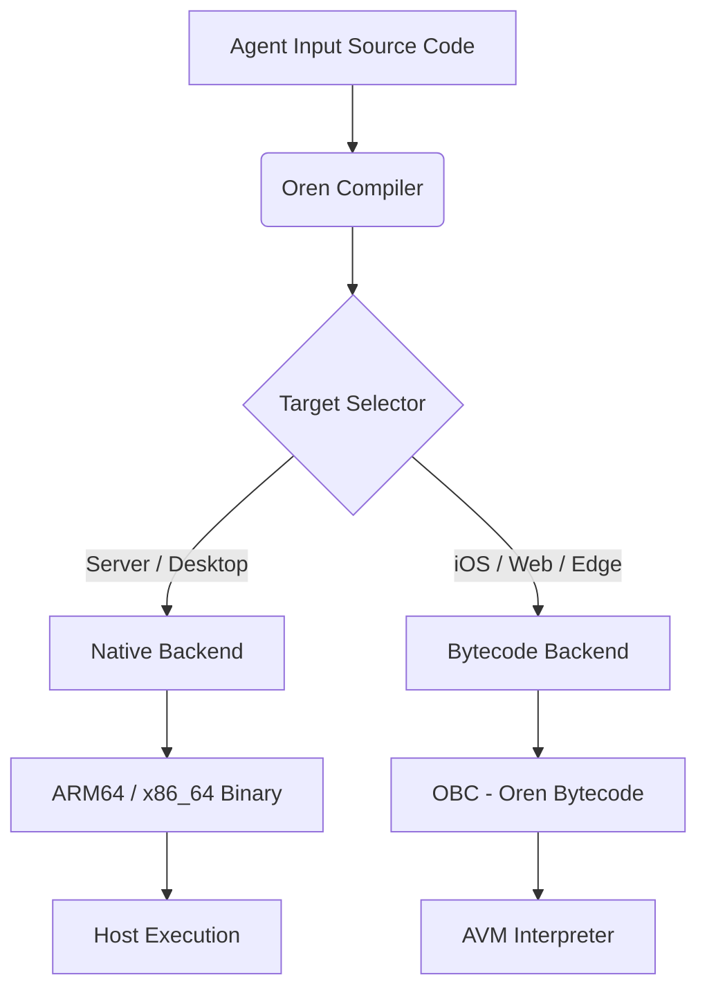

# Oren: The Agent-Native Language Evolution

**Date:** December 14, 2025
**Status:** Active Strategy
**Target:** AVM (Agent Virtual Machine) Integration

---

## 1. The Vision: "Universal Agency"

The ultimate goal of Oren is to become the **"Native Tongue of AI Agents."**
It is designed to solve the "Sandbox Paradox": The need for Agents to have powerful, system-level capabilities while running safely in restricted environments (like iOS, Edge, or WebAssembly) where standard tools (GCC, Python) are unavailable or illegal.

**The "Hybrid Runtime" Philosophy:**
Oren is not just a compiled language; it is a dual-mode system:
1.  **Native Mode (Server/Desktop):** Transpiles to C or Machine Code for maximum performance.
2.  **Bytecode Mode (Mobile/Restricted):** Compiles to portable bytecode (OBC) for safe interpretation on the AVM.

---

## 2. The Architecture

The Oren compiler (`lib/compiler`) processes source code into a shared **AST**. From there, it selects a backend based on the target environment.

---

## 3. The Roadmap

### Phase 1: The "AVM Core" (The VM)
**Goal:** Establish the runtime engine for restricted environments.
*   **Task:** Create `libavm` (in C), a lightweight Stack Machine.
*   **Spec:** Define the **OBC (Oren Bytecode)** instruction set (e.g., `PUSH`, `ADD`, `STORE`, `CALL`).
*   **Validation:** Manually write a "Hello World" in bytecode and run it with `libavm`.

### Phase 2: The "Bytecode Backend"
**Goal:** Enable the Oren Compiler to generate OBC.
*   **Task:** Implement `lib/compiler/codegen_bytecode.oren`.
*   **Logic:** Walk the AST and emit OBC instructions instead of ARM64 assembly.
*   **Deliverable:** `oren build script.oren --target=bytecode` -> `script.obc`.

### Phase 3: The "Inception" (Self-Hosting on iOS)
**Goal:** Run the Compiler itself inside the Interpreter.
*   **Strategy:**
    1.  Compile the Oren Compiler (`oren.oren`) into `oren.obc` using the Stage 0 Go compiler.
    2.  Embed `oren.obc` and `libavm` into the iOS App.
    3.  **Runtime Flow:** 
        *   Agent sends Source Code.
        *   `libavm` runs `oren.obc` (The Compiler) to process Source -> User Script OBC.
        *   `libavm` runs User Script OBC.
*   **Result:** A fully autonomous, compiling agent on a locked-down device.

### Phase 4: The "Agent Standard Library" (`libagent`)
**Goal:** Provide high-level, safe primitives for Agent tasks.
*   **Task:** Create standard library modules that map to AVM primitives.
    *   `fs`: Safe file I/O (`fs.read_text`, `fs.write_text`).
    *   `net`: HTTP client (`http.get`, `http.json`).
    *   `semantic`: Vector search and embeddings support.
    *   `proc`: Safe subprocess management (where allowed).

### Phase 5: LLM Optimization
**Goal:** Reduce token usage and hallucination.
*   **Task:** Refine syntax to be "Inference-Friendly."
*   **Feature:** "Script Mode" (implicit `main`, top-level statements).
*   **Feature:** Strong `ffi` (Foreign Function Interface) to bind easily to host capabilities.
*   **Artifact:** `LLM_GUIDE.md` - A 50-line definitive guide for few-shot prompting.

---

## 4. Why This Wins

| Feature | C / C++ | Python | WASM | **Oren (Hybrid)** |
| :--- | :--- | :--- | :--- | :--- |
| **Performance** | Native | Slow | Near-Native | **Native** (Server) / **Interpreted** (Mobile) |
| **iOS/AppStore** | **Banned** (No Exec) | Hard to Embed | Supported | **Native Support** (via Interpreter) |
| **Agent Safety** | Dangerous | Safe | Safe | **Safe** (Managed Runtime) |
| **Dependency** | High (GCC/Clang) | High (PyRuntime) | High (Toolchain) | **Zero** (Self-Contained) |

---

## 5. Current Status (Dec 2025)

*   **Compiler:** Self-hosting (Stage 2) active.
*   **Backends:** C (Transpiler), ARM64 native backend, and bytecode backend operational.
*   **AVM:** `lib/avm` stack-machine interpreter exists; `.obc` can be emitted and executed.
*   **Host calls:** capability-scoped `CALL_NATIVE2(domain, op, nargs)` exists (rolling ABI), with FS and CORE domains started.
*   **Next Step:** Continue hardening the AVM for agent workloads: verifier + budgets + deterministic mode + snapshotting.

---

## 6. The Paradigm Shift: A Symbiotic Language

Oren represents a fundamental departure from traditional software engineering history. It is arguably the first **"Synth-Origin"** language—designed, implemented, and evolved primarily by AI Agents under human architectural guidance.

### Bio-Origin vs. Synth-Origin

*   **Traditional Languages (Bio-Origin):** Designed by humans for human cognition. Optimization metrics include readability, community consensus, and backward compatibility. Change is slow (years).
*   **Oren (Synth-Origin):** Designed by AI for AI execution. Optimization metrics include **Token Efficiency**, **Parsing Unambiguity**, and **Self-Correction**. Change is instantaneous based on need.

### The AI-Native Advantage

1.  **"Zero-Shot" Clarity:** The syntax avoids the "human-friendly" irregularities (like C++'s complex parsing rules) that cause LLMs to hallucinate. It settles into a "local minimum" of logic that is natively understandable by models.
2.  **The Self-Correction Loop:** In traditional languages, a compiler bug takes months to patch. In Oren, an Agent can theoretically encounter a bug, read the compiler's source, fix it, recompile the compiler, and resume execution—all in a single session. The "Tool" fixes the "Toolmaker."
3.  **Bootstrap Velocity:** While languages like Rust or Swift took years of committee work, Oren achieved self-hosting and native compilation in a fraction of the time. This proves that **AI-Assisted Language Design** allows for domain-specific language forking in an afternoon.

### The "Governance" Revolution

In C++, a committee debates a feature for years. In Oren, the "Compiler Engineer" and the "End User" are the same entity (the Agent). If a feature is needed (e.g., "Add bytecode for iOS"), the Agent implements the language feature, the compiler backend, and the runtime simultaneously.

**Oren is the first language where the feedback loop between Language Designer and Language User is closed instantly.**

---

## 7. Strategic Realism: The Path to Victory

To succeed in a landscape dominated by giants (Python, Rust, Go, C++), Oren must be brutally realistic about its position.

### The Anti-Goal
*   **We will NOT beat Python for humans.** The ecosystem (NumPy, PyTorch) is insurmountable.
*   **We will NOT beat Rust for safety.** The borrow checker is too mature.

### The Winning Niche: "PostScript for Agents"
Just as PostScript became the invisible standard for Printers, Oren aims to become the **Invisible Standard for Agents**.
*   Agents need a format that is **Safe**, **Portable**, and **Resumable**.
*   Oren is not the language humans *want* to write; it is the language Agents *need* to output to survive in the wild.

### The Trojan Horse: Mobile & Edge
There is currently **zero competition** for high-performance, dynamic agent execution on iOS/Android due to App Store "No JIT" rules.
*   **The Wedge:** Mobile apps will embed `libavm` not for the syntax, but because it is the *only* legal way to run fast, dynamic AI logic (via SIMD-accelerated Interpretation).
*   **Adoption:** Once `libavm` is on millions of devices, Oren becomes the de-facto standard for Edge AI.

### Execution Priority
**Runtime Magic > Syntax Sugar.**
The Agent will write whatever syntax we tell it to. The adoption depends entirely on the **AVM's capabilities**:
1.  **Snapshotting:** "Pause and Heal" is the killer feature.
2.  **Security:** Capability Contracts must be unbreakable.
3.  **Portability:** The Bytecode interpreter must run everywhere.

References for the current AVM direction:

- Bootstrap VM (current): `docs/AVM_SPEC.md`
- Next-gen AVM plan (no-JIT-first, ML-focused typed buffers/SIMD, capability domains): `docs/AVM_SPEC_V1.md`
- Capability model: `docs/AVM_CAPABILITIES.md`
- Killer-feature requirements: `docs/AGENTIC_VM_KILLER_FEATURES.md`
- Agentic AI top requirements: `docs/AGENTIC_AI_TOP_FEATURES.md`

---

## 8. Tactical Reality: Current Gaps (Dec 2025)

The native backend and bytecode backend have progressed quickly; some previously blocking gaps have been addressed, but “production-ready” still requires hardening, specs, and a capability-governed runtime.

### Critical Blocks
These remain the highest-risk areas for correctness and portability:

1. **Capability governance:** the VM/runtime must enforce domain-scoped host calls (FS/NET/PROC/TIME/CRYPTO/SIMD), budgets, and explicit allow-lists.
2. **Snapshotting + determinism:** required for self-healing and reliable “retry with fix” workflows.
3. **Memory + concurrency hardening:** GC, thread/task interaction, and blocking primitives must be robust and deadlock-free.

### Immediate Action Plan
We stabilize the execution substrate while evolving the specs in parallel:

1. **Keep the bootstrap AVM working** while drafting the next-gen plan (typed buffers + SIMD kernels + capability domains).
2. **Implement byte-accurate I/O primitives** as a foundation for `.obc` and model artifacts (in progress; `read_bytes` exists).
3. **Implement syscall-first runtime direction** (no C shims), starting with macOS and validating on Linux.
4. **Add the “agent substrate” hardening loop:** verifier + budgets + timeouts + deterministic record/replay + snapshotting.

**Status:** AVM is in bootstrap mode; agent-grade execution requires capability enforcement + metering + typed buffers + determinism + snapshotting.
**Repo policy:** currently rolling/unstable until a stability milestone is declared.
